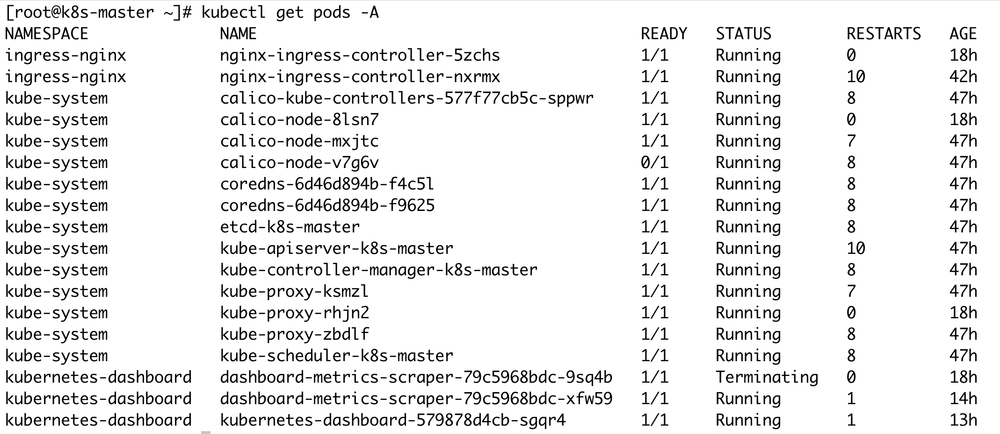
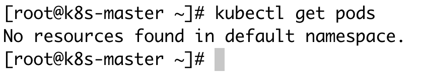
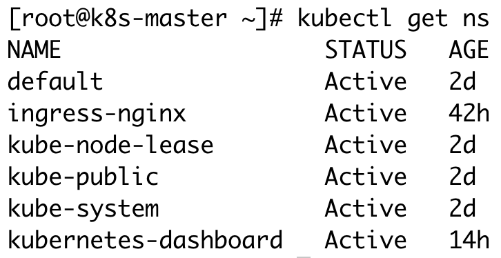

## Kubernetes基础概念理解

## Kubernetes命令应用与解释
+ pod
  + 每个pod相当与被部署的一个应用，执行命令： 
  ```shell
  kubectl get pods -A
  # 输出结果
  ```
  
+ namesapce：命名空间，主要是进行资源隔离（具体哪些资源未知？）
+ name：部署pod的应用名称，每个被部署的应用都有自己的“命名空间”
*上述执行的命令是 -A，表示的是获取所有k8s中的应用，而如果执行命令*
    ```shell
    # 表示只是获取【默认】命名空间下的应用
    kubectl get pods
    # 输出结果
    ```
   
   *No Resources的原因是没有在defalut namesapce中部署应用*
+ 查看所有命空空间，执行命令
  ```shell
  kubectl get ns
  # 输出结果如下
  ```
  
## Kubernetes组建
